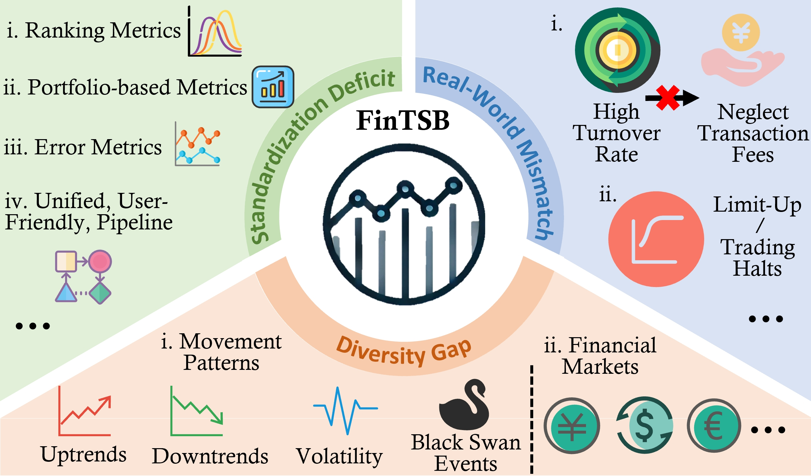
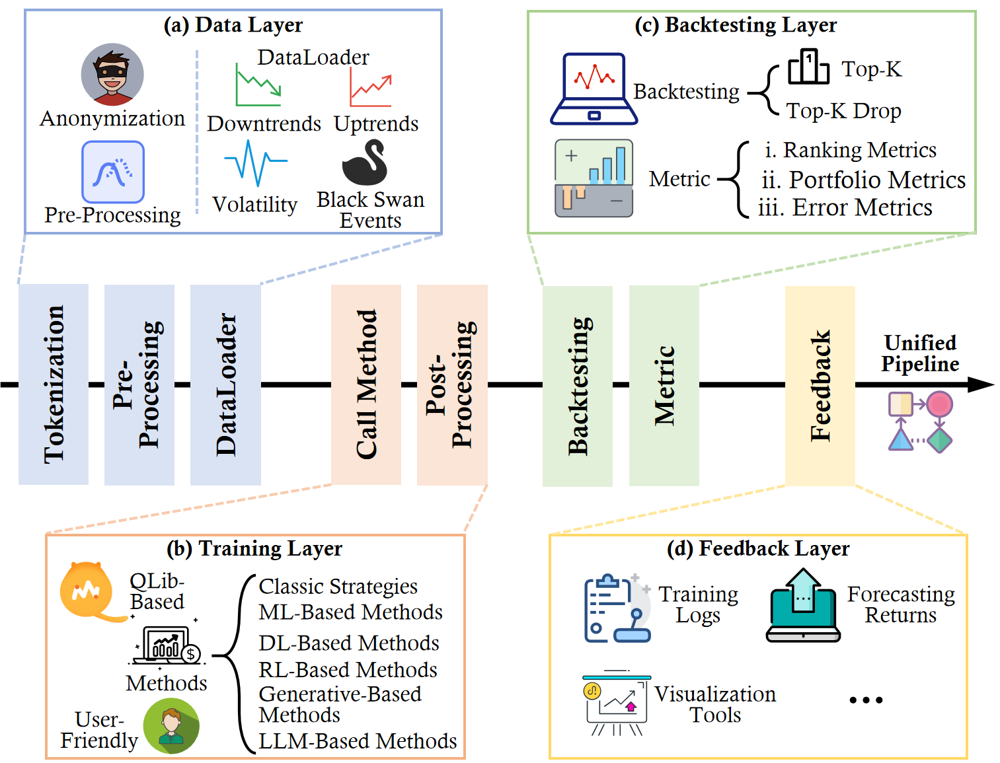

# FinTSB: A Comprehensive and Practical Benchmark for Financial Time Series Forecasting


## 📰 News
🚩 Updates (2025-04-24) Our paper has been featured on [时序人](https://mp.weixin.qq.com/s/q6JaGTuEyb4d4fCcYw4cEg), [QuantML](https://zhuanlan.zhihu.com/p/29805411840), and [PaperWeekly](https://mp.weixin.qq.com/s/0O8CMX8KryHt3X_kkAzRKg).

🚩 Updates (2025-02-27) Initial version available on arXiv [FinTSB](https://arxiv.org/abs/2502.18834).

🚩 Updates (2025-02-24) First version of the FinTSB code released.

## 🌟 Overview

**FinTSB** is a comprehensive and practical financial time series benchmark. Our goal is to address the three systemic limitations in the evaluation of the Financial Time Series Forecasting field.<br>
➊ Failure to account for the full spectrum of stock movement patterns observed in dynamic financial markets (**Diversity Gap**).<br>
➋ The absence of unified assessment protocols undermines the validity of cross-study performance comparisons (**Standardization Deficit**).<br>
➌ Neglect of critical market structure factors, resulting in inflated performance metrics that lack practical applicability (**Real-World Mismatch**).<br>

<div align="center">
      
</div>

## 🛠 Prerequisites

Ensure you are using Python 3.10.16 and install the necessary dependencies by running:

```
pip install -r requirements.txt
```

## 📊 Prepare Datastes

Begin by downloading the required datasets. All datasets are conveniently available at [https://quantapi.eastmoney.com/](https://quantapi.eastmoney.com/). After downloading the data, you should preprocess it as outlined in our paper (We will open source it as soon as the camera-ready version of the paper is published). Finally, create a separate folder named `./data` and neatly organize all the CSV files as shown below:

```
FinTSB
└── extreme
    └── dataset_1.pkl
    └── dataset_2.pkl
    └── dataset_3.pkl
    └── dataset_4.pkl
    └── dataset_5.pkl
└── fall
    └── dataset_1.pkl
    └── dataset_2.pkl
    └── dataset_3.pkl
    └── dataset_4.pkl
    └── dataset_5.pkl
└── fluctuation
    └── dataset_1.pkl
    └── dataset_2.pkl
    └── dataset_3.pkl
    └── dataset_4.pkl
    └── dataset_5.pkl
└── rise
    └── dataset_1.pkl
    └── dataset_2.pkl
    └── dataset_3.pkl
    └── dataset_4.pkl
    └── dataset_5.pkl
```

## 💻 Training Pipline

The pipeline of FinTSB includes the Data layer, Training layer, Backtesting layer, and Feedback layer, as shown in the figure below.

<div align="center">
      
</div>

All configs are located in `./configs`. For instance, to train the LSTM model using the FinTSB dataset, simply run:

```shell
python train.py --config_file configs/config_lstm.yaml
```

After training:

- Your trained model will be safely stored in `./output/model.bin`.
- Numerical results in .csv format and .pkl format can be found in `./output/backtest_result.csv` and `./output/pred.pkl`.
- A comprehensive summary of quantitative metrics is accessible in `./output/backtest_report.txt`.
- A visualization is available in `./output/xxx.jpg`.

## 📚 Citation
If you find this repo useful, please consider citing our paper as follows:
```bibtex
@article{hu2025fintsb,
  title={FinTSB: A Comprehensive and Practical Benchmark for Financial Time Series Forecasting}, 
  author={Yifan Hu and Yuante Li and Peiyuan Liu and Yuxia Zhu and Naiqi Li and Tao Dai and Shu-tao Xia and Dawei Cheng and Changjun Jiang},
  journal={arXiv preprint arXiv:2502.18834},
  year={2025},
}

@article{hu2025finmamba,
  title={FinMamba: Market-Aware Graph Enhanced Multi-Level Mamba for Stock Movement Prediction}, 
  author={Hu, Yifan and Liu, Peiyuan and Li, Yuante and Cheng, Dawei and Li, Naiqi and Dai, Tao and Bao, Jigang and Xia Shu-Tao},
  journal={arXiv preprint arXiv:2502.06707},
  year={2025}
}

@inproceedings{
hu2025timefilter,
title={TimeFilter: Patch-Specific Spatial-Temporal Graph Filtration for Time Series Forecasting},
author={Yifan Hu and Guibin Zhang and Peiyuan Liu and Disen Lan and Naiqi Li and Dawei Cheng and Tao Dai and Shu-Tao Xia and Shirui Pan},
booktitle={Forty-second International Conference on Machine Learning},
year={2025},
url={https://openreview.net/forum?id=490VcNtjh7}
}

@inproceedings{hu2025adaptive,
  title={Adaptive Multi-Scale Decomposition Framework for Time Series Forecasting},
  author={Hu, Yifan and Liu, Peiyuan and Zhu, Peng and Cheng, Dawei and Dai, Tao},
  booktitle={Proceedings of the AAAI Conference on Artificial Intelligence},
  year={2025}
}

@inproceedings{bian2024multi,
  title={Multi-patch prediction: adapting language models for time series representation learning},
  author={Bian, Yuxuan and Ju, Xuan and Li, Jiangtong and Xu, Zhijian and Cheng, Dawei and Xu, Qiang},
  booktitle={Forty-first International Conference on Machine Learning},
  year={2024}
}
```

## 🙏 Acknowledgement
#### All thanks to contributors. 

<a href="https://github.com/TongjiFinLab/FinTSB/graphs/contributors">
  
</a>

#### Special thanks to the following repositories for their invaluable code and datasets:

- [Eastmoney Inc.](https://www.eastmoney.com/)
- [Microsoft QLib](https://github.com/microsoft/qlib)

## 📩 Contact
If you have any questions, please contact [huyf0122@gmail.com](huyf0122@gmail.com) or submit an issue.
